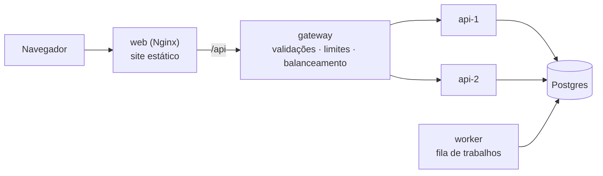

# Arquitetura



O repositório tem quatro pacotes:

| Pacote     | O que é |
|------------|---------|
| `shared`   | Kernel compartilhado: enums do jogo, regras numéricas, sorteio com semente, apuração de votos, validação de frases, regras de conta e o **manifesto da API**. Front, back e gateway usam o mesmo código, sem cópias. |
| `backend`  | API (Express) em camadas: `domain` → `application` → `infrastructure` / `presentation`, montadas em `main`. Também o **worker** da fila. |
| `frontend` | Site (React + Vite). |
| `gateway`  | API Gateway (Node puro): barra requisições inválidas antes do backend e distribui a carga entre as instâncias. |

Os pacotes se ligam por `file:../shared`. Em desenvolvimento e nos testes, o kernel entra pelo código-fonte
(`--conditions=source` no `tsx`, alias no Vite/Vitest); em produção, pelo `shared/dist` (o `prebuild` compila).

## Manifesto da API (`shared/src/api/routes.ts`)

Cada rota é declarada uma vez, com método, caminho, quem pode chamar (`public`, `user`, `owner`), a regra de dono do
recurso (`seasonRead`, `seasonWrite`, `cast`, `character`) e o grupo de limite de tentativas (`auth`, `imageProxy`).

- O **backend** monta o roteador a partir dele (`presentation/http/routes`), aplicando os middlewares de acesso.
  Cada rota precisa de um handler: o TypeScript acusa rota sem handler.
- O **gateway** usa o mesmo manifesto para responder 404/405/400/401 sem chamar o backend.

### Como adicionar uma rota

1. Declare a rota no manifesto (`API_ROUTES`).
2. Crie o caso de uso em `backend/src/application/use-cases`.
3. Ligue no controller do grupo com o adaptador `endpoint()`:
   ```ts
   'seasons.archive': endpoint(s.archive, { params: seasonIdParams, status: 204 }),
   ```
   O `endpoint()` valida params/query/corpo com os esquemas zod, junta quem está logado (`identity: 'ownerId' | 'actor'`)
   e responde. Se os esquemas não produzirem a entrada que o caso de uso espera, o `tsc` falha nessa linha.
4. Instancie o caso de uso no `main/container.ts` (composition root).

## Padrões usados

| Padrão | Onde | Para quê |
|--------|------|----------|
| Repository + Unit of Work | `domain/repositories`, `infrastructure/repositories`, `PgUnitOfWork` | Casos de uso não conhecem SQL; tudo de uma ação roda numa transação. |
| Composition Root | `main/container.ts` | Único lugar que conhece as implementações concretas (fácil trocar/injetar nos testes). |
| Adapter | `presentation/http/endpoint.ts` | HTTP → caso de uso de forma declarativa, com checagem de tipos entre esquema e entrada. |
| Template Method | `application/services/undo.ts` (`UndoableRecord`) | Registros de fase: transação → guardar estado para o "voltar" → `record()`. A simulação reaproveita `record()`. |
| Strategy | `use-cases/simulation/strategies` (fase e modo de jogo), `gateway/src/upstream/pool.ts` (balanceamento) | Trocar o comportamento sem `if` espalhado; um modo online vira mais uma estratégia de `SimulationMode`. |
| Command | `domain/simulation/humanActions.ts` (ações do jogador), `application/jobs` (handlers de trabalhos) | Um handler por ação/tipo, registrados num mapa. |
| Chain of Responsibility | `gateway/src/pipeline.ts`, middlewares do Express | Cada verificação responde ou passa adiante. |

## Gateway

Ordem das verificações (da mais barata para a que lê o corpo); o backend só recebe o que passou por todas:

| Etapa | Resposta | O que confere |
|-------|----------|---------------|
| `ipRateLimit` | 429 | Limite geral por IP (inclui quem varre rotas inexistentes). |
| `routeGuard` | 404 / 405 / 400 | Rota existe no manifesto, método certo, ids com formato de UUID. |
| `routeRateLimit` | 429 | Limite do grupo da rota (login/cadastro, proxy de imagens). |
| `originGuard` | 403 | CSRF: escrita vinda de página de outro site. |
| `sessionGate` | 401 | Rota de quem está logado sem o cookie da sessão (quem valida a sessão é o backend). |
| `bodyGuard` | 413 / 415 / 400 | Corpo até o limite, só JSON, JSON bem formado. |
| `proxy` | 502 / 503 / 504 | Escolhe a instância (round-robin ou least-connections), repassa em streaming. |

- **Saúde das instâncias:** checagem ativa em `/health/ready` de cada instância (a que está desligando responde 503 e
  sai da roda) e passiva (falha de conexão tira da roda até a próxima checagem).
- **Failover:** se a conexão foi recusada, a requisição comprovadamente não chegou e vai para outra instância, qualquer
  que seja o método; leituras (GET) também são repetidas em outros casos. Escritas que podem ter chegado não são repetidas.
- **Rastreio:** `X-Request-Id` gerado no gateway, repassado ao backend e devolvido na resposta (aparece nos logs e na
  mensagem de erro 500 do site). O backend recebe `X-Forwarded-For` com o IP apurado pelo gateway (`TRUST_PROXY=true`).

## Fila de trabalhos

A fila fica no próprio Postgres (`jobs`), sem infraestrutura nova:

- `claim()` usa `FOR UPDATE SKIP LOCKED`: vários workers dividem o trabalho sem pegar o mesmo item.
- Falhas voltam para a fila com espera crescente (2^tentativas s); passando do máximo, ficam como `failed` (fila de mortos).
- Um trabalho "rodando" há mais de 5 min (worker que caiu) volta a ser entregue.
- `dedupeKey` evita duplicar o mesmo trabalho (o agendador usa `tipo:janela`, então várias instâncias não duplicam).
- Como a fila está no mesmo banco, `repos.jobs.enqueue()` dentro de um caso de uso só publica o trabalho se a transação
  der certo (efeito de *outbox* sem esforço extra).

Para criar um trabalho: implemente `JobHandler` (`type` + `handle(payload)`), registre no `main/worker.ts` e enfileire
com `repos.jobs.enqueue({ type, payload })`. Trabalhos periódicos entram no `MAINTENANCE_SCHEDULE` (ou numa lista própria).

Hoje o worker apaga as sessões vencidas (antes era feito a cada login) e limpa o histórico da fila.

## Segurança

- **Sessão:** token aleatório no cookie `httpOnly`/`SameSite=Lax` (`Secure` em produção); só o hash SHA-256 vai ao banco.
  Senhas com scrypt; login com tempo constante para usuário inexistente.
- **CSRF:** além do `SameSite`, a origem de toda escrita é conferida (gateway e backend).
- **SSRF no proxy de imagens:** só http(s); o IP é conferido **na hora da conexão** (fecha o DNS rebinding); só endereços
  públicos (bloqueia privados, loopback, link-local/metadados de nuvem, CGNAT, NAT64/6to4/IPv4 mapeado para faixas internas);
  cada redirecionamento passa pelas mesmas regras; tempo e tamanho limitados enquanto baixa.
- **Limites:** por IP no gateway e no backend (login/cadastro e proxy de imagens com limites próprios).
- **Cabeçalhos:** `nosniff`, `DENY` em molduras, `no-referrer`, CSP restritiva nas respostas da API, `no-store`, HSTS com HTTPS.
- **Erros:** o cliente nunca vê detalhes internos; erro 500 traz só o id da requisição.
- **Redirecionamento após o login:** só caminhos do próprio site (`//site` e `/\site` são recusados).

## Próximos passos para os modos online

- **Tempo real:** publicar "a temporada mudou" (`LISTEN/NOTIFY` do Postgres alcança todas as instâncias da API) e entregar
  ao navegador por SSE ou WebSocket. O gateway já repassa respostas em streaming.
- **Ações longas na fila:** "simular até o fim" pode virar um trabalho (`202 Accepted` + acompanhar pelo estado),
  sem prender a requisição nem depender do tempo limite do balanceador.
- **Limites compartilhados:** com várias instâncias do gateway, troque o `MemoryRateLimitStore` por um armazenamento
  compartilhado (Redis, por exemplo) implementando `RateLimitStore`.
- **Vários jogadores humanos:** o `SimulationMode` já separa de onde vêm as decisões; um modo online é uma nova estratégia,
  e a `Viewer`/`playerView` já esconde o que cada participante não pode ver.
